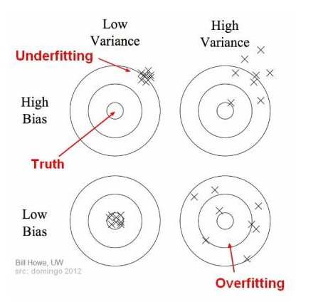
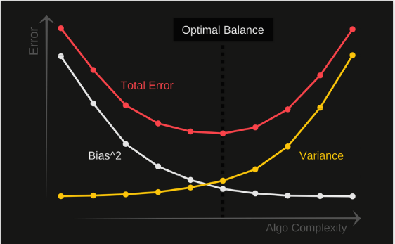

### Error in Supervised learning

Error = bias + variance + noise
- noise = unmanageable
- variance = fitting to noise
- bias = missing signal

#### Bias
Bias is the difference between the average prediction of our model and the correct value which we are trying to predict. Model with high bias pays very little attention to the training data and oversimplifies the model(underfitting).

Bias are the simplifying assumptions made by a model to make the target function easier to learn.Generally, linear algorithms have a high bias making them fast to learn and easier to understand but generally less flexible. Examples of high-bias machine learning algorithms include: Linear Regression, Logistic Regression.

#### Variance
Variance is the variability of model prediction for a given data point or a value which tells us spread of our data. Model with high variance pays a lot of attention to training data and does not generalize on the data which it hasn’t seen before. As a result, such models perform very well on training data but has high error rates on test data. (Overfitting)

High variance may result from an algorithm modeling the random noise in the training data

#### Bias and Variance Tradeoff

The bias-variance tradeoff is a central problem in supervised learning. 

Ideally, one wants to choose a model that both accurately captures the regularities in its training data, but also generalizes well to unseen data. 

Unfortunately, it is typically impossible to do both simultaneously. High-variance learning methods may be able to represent their training set well but are at risk of overfitting to noisy or unrepresentative training data. 

In contrast, algorithms with high bias typically produce simpler models that may fail to capture important regularities (i.e. underfit) in the data. (Wikipedia)

These different ensemble methods tackle the tradeoff in different ways
- forests = high variance, low bias base learners
- boosting = low variance, high bias base learners

** The component / individual learner of the ensemble which are combined strategically is referred to as Base learners.

